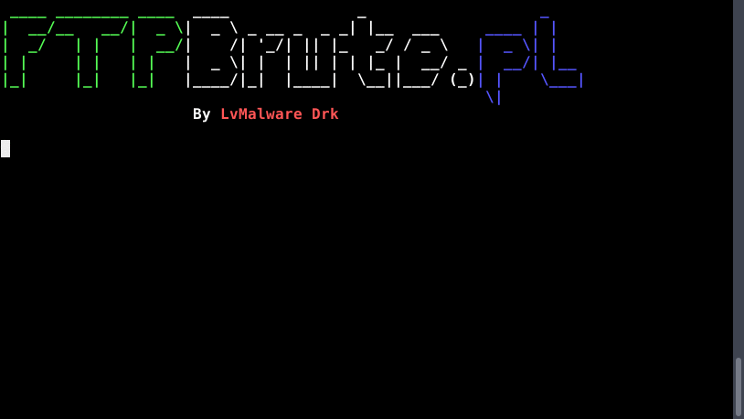

# FTPBrute.pl

A FTP (File Transfer Protocol) password cracking tool, written in Perl.

It uses a brute force process with the user provided passwords and usernames wordlists.

# TODO

- Add multi-threading capabilities
- Add the capability of specifying a different port for each target
- Add other useful features such as random password generation
